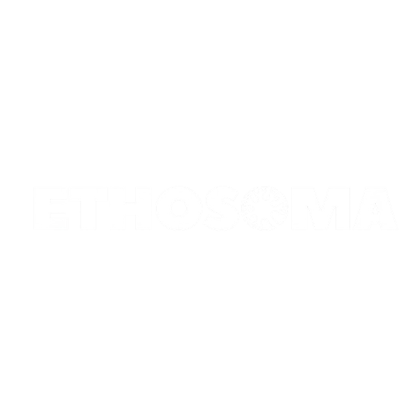

<p align="center"></p>

# Ethosoma — Drosophila Connectome Digital Twin

<p align="center">
  <a href="https://ethosoma.dpdns.org"></a>
  <a href="LICENSE"></a>
</p>

**Ethosoma** is an in-silico ethological twin of the adult female *Drosophila melanogaster* brain: the complete FlyWire FAFB v14.1 reconstruction — 139,255 proofread somas resolved from serial-section electron microscopy — mounted inside a real-time WebGL brain simulator and coupled to a computational-allostasis engine governed by socio-economic stress dynamics.

Where classic connectomics freezes the wiring diagram, Ethosoma *runs* it. Neuromodulatory state (PAM reward dopamine, PPL1 aversive dopamine, octopaminergic arousal, serotonin, sleep pressure, circadian phase) is continuously integrated against an exogenous stressor layer — heat, queues, deadlines, inflation, kinship obligations — and rendered as travelling GCaMP-style calcium transients across the real circuit modules: optic columns, mushroom-body valence, and central-complex action selection.

## Key Features

- **Neural network topologies** — Every subsystem inherits its exact soma counts from the FAFB reconstruction: 81,324 medulla + lobula optic-lobe cells, 42,027 T-series motion columns, 4,657 mushroom-body calyx Kenyon cells, 2,196 central-complex integrators, rendered as a 139,255-GPU-point volumetric cloud at 4×4×40 nm voxel fidelity (JRC2018U space).
- **Allostatic phase space** — A six-state adult-female ethogram (locomotion, grooming, quiescence, escape, depressive freeze, economic-quiescence/metabolic deprivation freeze) driven by a forced slow–fast hybrid dynamical system with saddle-node fold bifurcations, epigenetic kindling, and path-dependent bio-energetic strain.
- **Live parametric tuning** — Nudge the neuromodulatory population vector and environmental stressor mix in-browser and watch the basin of attraction deform: activation thresholds, allostatic scarring, and economic-quiescence latching all respond interactively.
- **WebGL 2 interactive brain simulation** — Hardware-accelerated Three.js pipeline with traveling-wave stimuli, circuit-module telemetry, and optogenetics-compatible calcium envelopes at 60 fps.

## Local Setup

```bash
git clone https://github.com/piee777/ethosoma.git
cd ethosoma
```

The simulation engine is written in dependency-free ES modules and Three.js (v0.160) is served via import map, so viewing the site needs no build step and no install. You only need Python 3 (standard library) or any static-file server.

The sole npm dependency in the repository is `@netlify/blobs`, used by the optional analytics Function described below — it is only needed when you deploy to Netlify or run `netlify dev`.

```bash
# Option A — Ethosoma dev server (serves frontend/ + models/, correct MIME + CORS)
python3 backend/server.py --port 8000

# Option B — plain static server from the frontend tree
python3 -m http.server 8000 -d frontend
```

Then open **http://localhost:8000** — the landing page (research methodology) and **Launch Simulation Studio** (interactive twin) are both served from the same origin.

## Admin Dashboard

A private, key-gated console at **`/admin.html`** reports anonymous session telemetry: total visitors, average time spent, top visiting countries, device split, and a per-session log with date/time, country, device, time spent, and entry page. A manual refresh button and a 30-second auto-refresh toggle are both provided.

### Running it

**On the deployed site** (the only place geo data and persistence are real):

```bash
# 1. Set the secret in Netlify: Site configuration -> Environment variables
#    ADMIN_KEY = <openssl rand -base64 32>
netlify deploy --prod        # or push to main and let the build run
```

Then open **`https://<your-site>/admin.html`** and paste the secret at the lock screen.

**Locally**, for development:

```bash
npm install                                   # only @netlify/blobs
printf 'ADMIN_KEY=%s\n' "$(openssl rand -hex 24)" > .env
npm run dev                                   # http://localhost:8888/admin.html
```

`npm run dev` starts a dependency-free server (`scripts/dev-server.mjs`) that serves `frontend/` and mounts the analytics Function in-process. Two things differ from production, and the console tells you about the first one on screen:

- **No persistence.** There is no Blobs context outside Netlify, so sessions live in memory and reset when the server restarts. The console surfaces this as a `storage: memory` warning.
- **No geo data.** Country codes come from Netlify's edge headers, which do not exist locally, so every visit reports `??`.

To exercise both for real, deploy. For full local Netlify emulation use `npm run dev:netlify` — note that `netlify dev` installs your site's build plugins, which currently fails on npm ≥ 12 because remote tarball fetching is disabled by default (`EALLOWREMOTE`). That is a toolchain limitation, not a project one.

### How it works

| Piece | Role |
| --- | --- |
| `netlify/functions/analytics.js` | Netlify Function. `POST` ingests events, `GET` returns the metrics payload. |
| `scripts/dev-server.mjs` | Zero-dependency local server: static `frontend/` + the Function mounted in-process. |
| `frontend/js/tracking.js` | Loaded by `index.html` and `app.html`. Loaded by nothing else. |
| `frontend/admin.html` | The console. Gated client-side, authorized server-side. |

- **Session identity** — a random id generated once per tab and kept in `sessionStorage`. No cookies, no `localStorage`, no cross-site identifier; it dies with the tab and is reused across pages within it.
- **Duration** — a monotonic timer that only advances while the tab is visible, so a backgrounded tab does not inflate the number. A 15-second heartbeat plus `sendBeacon` on `visibilitychange` and unload report the running total; the server keeps the **maximum** received, so out-of-order beacons cannot lose time.
- **Geo** — read server-side from the edge (`x-country` / `cf-ipcountry`), never from the client, so it cannot be spoofed by page JavaScript.
- **Storage** — Netlify Blobs, retaining the last 200 sessions. If Blobs is unavailable the Function degrades to an in-memory store and the console says so rather than silently showing stale data.

### Configuration

Set the `ADMIN_KEY` environment variable in Netlify (Site configuration → Environment variables). Copy `.env.example` for local use and generate a value with:

```bash
openssl rand -base64 32
```

The console prompts for this secret, verifies it against the Function, and holds it in `sessionStorage` for the tab. **Every `GET` is re-authorized server-side** with a constant-time comparison and per-IP rate limiting — hiding the page is not the security boundary. If `ADMIN_KEY` is unset the admin surface is hard-disabled rather than defaulted open.

### Privacy

Stored per session: country code, coarse device class and browser/OS label, active seconds, entry path, referrer, and timestamps. No IP address is persisted, and the data is never shared with third parties. Visits to `/admin.html` itself are excluded so console use does not inflate the visitor count. If you need consent-gated or Do-Not-Track-aware collection before deploying publicly, `frontend/js/tracking.js` is the single place to add it.

## Repository Layout

```
backend/server.py         Threaded HTTP server (CORS + MIME-correct, traversal-safe)
netlify/functions/        analytics.js — session ingestion + authorized metrics endpoint
netlify.toml              Hardening headers for the private console
frontend/                 Landing (index.html) + simulation studio (app.html)
frontend/admin.html       Private analytics console
frontend/js/tracking.js   Session/duration telemetry collector
frontend/data/            Connectome binary + FAFB neuron / coordinate tables
frontend/assets/          Brand assets & anatomy renders
models/fly_brain.obj      Whole-brain anatomical mesh
scripts/ , tools/         Connectome processing & render utilities
```

## Data & Attribution

Connectome, annotations, and cell-type taxonomy derive from the 2024 *Nature* whole-brain reconstructions of the FlyWire consortium ([Dorkenwald et al.](https://doi.org/10.1038/s41586-024-07558-y), [Schlegel et al.](https://doi.org/10.1038/s41586-024-07686-5)). See the in-app Citations section for full attribution.

## License

Copyright (c) 2026 Adel Benaissa. All rights reserved. — released under the [MIT License](LICENSE).

## Live Deployment

**Ethosoma is now live at [https://ethosoma.dpdns.org](https://ethosoma.dpdns.org)** — the landing page and the interactive Simulation Studio are both deployed and publicly accessible.